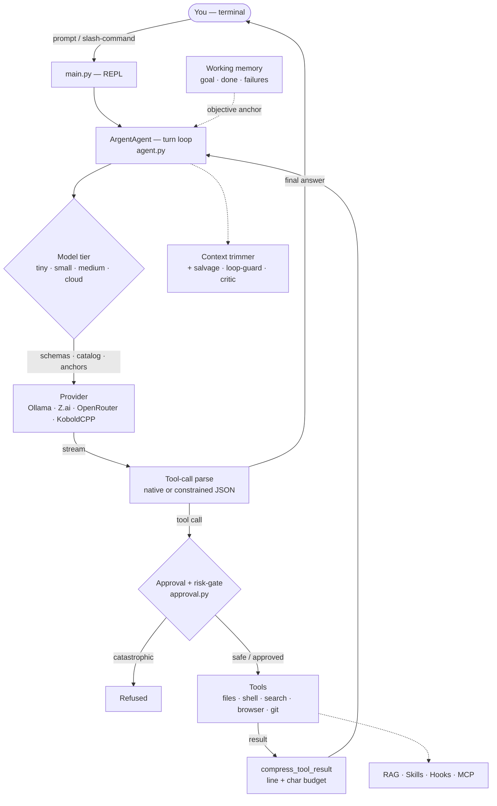

# Argent: The Elite AI Coding Assistant

[](https://github.com/Aslan008/Argent/actions/workflows/ci.yml) [](pyproject.toml) [](pyproject.toml)

Argent is a high-performance, professional AI pair programmer designed to live in your terminal. It supports local **Ollama** models, **Z.ai**, **OpenRouter**, and **KoboldCPP** API providers, leveraging advanced architectural patterns to provide an autonomous, efficient, and secure development environment.

> [!NOTE]
> Argent is a **personal experiment** in building high-autonomy AI agents for terminal-based development.
> [!CAUTION]
> **Warning**: This project is in active development and is considered experimental. Things may not work as expected, logic might fail, or code could potentially break. Use with caution.

---

## 🏗 Architecture

A single turn flows from your prompt through a tier-adaptive strategy, a provider,
and a safety gate before any tool touches your machine — while working memory,
context management and resilience wrap the whole loop.



---

## 🎚 Which autonomy do you want?

"Autonomous" means five different things in Argent. Pick by how much you intend to watch:

| Command | What it does | You are… |
| --- | --- | --- |
| `/vibe` | Safe actions auto-approved, destructive ones still ask, checkpoint every turn | at the keyboard, reading diffs |
| `/work [--auto] <task>` | Modify or fix an **existing** codebase | reviewing the result |
| `/project <prompt>` | Build a project from scratch: research → architecture → specs → code | reviewing milestones |
| `/auto <task>` | Full autonomous "experimenter": plans, works, sleeps on `wait_heartbeat`, stops itself with `end_auto_mode` | letting it run |
| `/tasks add …` | Scheduled work with **nobody watching** — gated actions are refused, not approved | asleep |

`/auto` and `/tasks` are the two genuinely unattended ones, and they differ in kind: `/auto` is one long task you started deliberately, `/tasks` is recurring work that starts itself. Both are bounded — `/auto` by an offered safety checkpoint and `end_auto_mode`, `/tasks` by a per-task toolset, a turn budget, and refusal of anything needing consent.

---

## 🚀 Key Features

### 🧠 Project Brain (Autonomous Mode)
Argent doesn't just answer questions; it builds entire projects. Utilizing a multi-state machine, Argent can:
- **Research**: Scour the web for the latest documentation.
- **Architect**: Design high-level system structures.
- **Spec**: Generate detailed per-file specifications.
- **Execute**: Implement code autonomously while managing its own context limits.

### 🧪 TDD Mode (Test-Driven Development)
Enable strict TDD to force the AI into a professional **Red-Green-Refactor** cycle. Argent will write failing tests, implement the code, and verify results before moving forward.

### 🪝 Global Plugins & Hooks
Extend Argent's core logic with Python plugins stored in `~/.argent/hooks/` (configurable via `/hooks`).
- **Autonomous Extension**: Argent can autonomously create new specialized tools when needed (toggle via `/hooks auto on`).
- **Lifecycle Hooks**: `on_startup`, `pre_prompt`, `post_response`, `on_tool_call`.
- **Custom Commands**: Define functions starting with `command_` to create your own slash commands.

### 🔍 Synchronous RAG (Semantic Search)
Never worry about outdated knowledge. Argent automatically indexes your codebase using **ChromaDB**. When files are modified, the RAG index is updated incrementally in real-time.

### 🌐 Intelligent Browser Control (CDP & Playwright)
Argent includes a powerful browser automation engine based on Playwright:
- **CDP Mode (User's Browser)**: Connects directly to your real browser (Chrome, Yandex Browser, Edge, Brave) to leverage your active sessions, cookies, and login states.
- **Auto-Attach**: Automatically attaches to your already open tabs without interrupting your workflow.
- **Visual & Structural Analysis**: Recursively crawls DOM trees across nested `iframe` and Shadow DOM boundaries.
- **Smart Filtering**: Supports multi-keyword search queries (logical OR) to filter complex web pages and reduce prompt size, with automatic feedback warnings for over-filtering.
- **Robust Actions**: Interact with elements using dynamic ID indexing, precise CSS selectors, or visible text, with automatic scrolling into view.

### 🚦 Automatic Model-Tier Adaptation (Zero Configuration)
Argent detects the model size from its name and silently adapts the whole pipeline — switch between a 1B local model and a cloud giant without touching a single setting:
- **Tiny models (Ollama)**: every agent step is **grammar-constrained at the decoder level** to a strict JSON schema — malformed tool calls become physically impossible to generate, not merely repaired afterwards. A compact tool catalog and an objective reminder are pinned near the end of the prompt, where small models actually attend.
- **Standard local models**: native tool calling plus the objective anchor for long histories.
- **Cloud models**: completely unburdened — no schemas, no catalogs, no reminders.
- **All tiers**: a deterministic **loop guard** catches verbatim-repeated tool calls (the classic small-model failure mode) and force-ends runaway turns; `replace_in_file` auto-corrects whitespace-broken edit targets with re-indentation instead of bouncing errors back.

### 🛡 Centralized Approval & Safe Autonomy
Every dangerous action (shell commands, file deletion, git rollback) passes through a single approval gate:
- **Destructive-command detection**: `rm` / `Remove-Item` / `format` / `git reset --hard` / `taskkill` and friends always require explicit confirmation — even in autonomous mode.
- **Session grants**: approve once with *"always allow `git` this session"* and stop clicking through repeated prompts.
- **Working autonomy**: in `/auto` mode safe actions are auto-approved so the agent can actually run unattended, while destructive ones still pause for you.

### 📉 Context-Aware Prompting
Every token in the system prompt costs a local model speed and focus, so Argent keeps it lean and tier-adaptive: weak models (tiny/small) get a slimmed core toolset instead of all ~52 schemas (a ~58% cut to the largest part of the prompt), the AGENTS.md memory is capped per tier, and `/stats` shows exactly where the budget goes (system prompt / tool schemas / history).

### 🆓 OpenRouter: free and paid models, one key
OpenRouter requires a single API key (a **free** one from [openrouter.ai/keys](https://openrouter.ai/keys) is enough). With it you can run the zero-cost `:free` models, and the moment you want a frontier model you just pick a paid one — same key, no reconfiguration. `/provider → openrouter` lets you list **free models only** or the full catalog, with free models surfaced first. For fully offline, no-key-at-all usage, Ollama remains the local option.

### 🧮 Exact Mathematics — Arithmetic and Symbolic
The `calculate` tool is two engines behind one entry point. Plain arithmetic runs on a whitelisted AST interpreter; anything symbolic falls through to SymPy: integrals (including improper ones), derivatives, one- and two-sided limits, equations and inequalities, ODEs, matrices, sums and series, statistics, integral transforms, geometry and unit conversion.

```text
integrate(exp(-x**2), (x, -oo, oo))  →  sqrt(pi)  ≈ 1.772453851
summation(1/k**2, (k, 1, oo))        →  pi**2/6   ≈ 1.644934067
dsolve(Derivative(y(x), x, 2) + y(x), y(x))  →  C1*sin(x) + C2*cos(x)
```

Neither path ever executes code. SymPy's own `sympify`/`parse_expr` call `eval` internally, so they are never handed raw model output — the expression is walked as an AST against an explicit whitelist and rebuilt node by node, which leaves no room for attribute access, imports or smuggled strings.

### 🕰 Time Machine — Fearless Editing
Before the **first file edit of every turn**, Argent commits a checkpoint of the pre-turn tree. Read-only turns stay commit-free, and a hand-crafted git index is never overwritten (you are told when a checkpoint is skipped, so you never believe you are covered when you are not).

- `/rewind` — pick any turn checkpoint and roll the whole tree back to it. Real user commits in between abort the rewind; uncommitted work is stashed first.
- `/undo <file>` — per-file rollback when only one edit went wrong.
- In natural language: *"вернись до того, как ты сломал меню"* — the agent matches the checkpoint by its message.

### 🌴 Vibe Mode
`/vibe` is one switch over existing knobs: safe actions are auto-approved, destructive ones still prompt, and per-turn checkpoints are guaranteed. The cost of a bad experiment drops to one `/rewind`.

### ⏰ Ambient Automation
Scheduled tasks that run by themselves while Argent is open — monitoring, reports, watching for changes.

```text
/tasks add report | daily at 09:00 | Collect metrics with `npm run stats` and write reports/daily.md
/tasks add watch | every 2h | Check the tracker for new issues | tools: search_web, read_webpage
/tasks run report      # run it now
/tasks runs            # what the agent did while you weren't looking
/tasks memory          # how much each task remembers
```

Unattended is not "interactive with the prompts turned off": **every gated action is refused and recorded**, because waiting would hang the scheduler and approving would hand an unsupervised model the authority to delete or publish. Each task is bounded by its own toolset, a turn budget, and a no-overlap rule. Schedules read back plainly (`every 15m`, `daily at 09:00`) — a misread cron line in a job nobody is watching is expensive.

**It remembers between runs.** A monitoring task calls `filter_new_items` with what it found and gets back only what it has not reported before — otherwise every run repeats the same twenty results and you stop reading it by the third day. The memory is transactional: items are committed only once the run finished, so a crash leaves them unseen instead of silently swallowing the one thing you were watching for. `/tasks forget <name>` resets it.

**It tells you — but only when it matters.** A finished run raises a desktop notification if it found something new, broke, or hit an action that needs you. A silent run stays silent, because a toast after every tick trains you to dismiss them unread.

### 🔎 Federated Web Research
Several independent sources are queried in parallel and merged, so one of them rate-limiting or failing costs nothing: DuckDuckGo, Wikipedia, StackExchange, GitHub issues, and Brave when you add a key.

- **Search operators work** — `"exact phrase"`, `site:`, `filetype:`, `-exclude`, `intitle:` — and each engine receives only the ones it can honour, translated into its own dialect where an equivalent exists (GitHub's `in:title`, StackExchange's `title` parameter). An operator an engine cannot use is dropped rather than searched for as literal text.
- **StackExchange is a network, not a site.** A cue-matched site (gamedev, math, serverfault…) is queried alongside stackoverflow.com — measured, "Unity Addressables memory leak" returns nothing on stackoverflow and answers on gamedev, while a shader question is the other way round.
- **Optional second index.** Adding a Brave key unions two genuinely independent indexes; measured on real queries, 75% of results were unique to one engine.
- **Multilingual reranking.** A cross-encoder reorders the candidates. The default is English-only and, measured, scores relevant non-English text below mediocre English text — so `/search` can switch to a multilingual model when you research in other languages.

Configure it all from inside Argent with `/search` (the API key is entered masked and never echoed).

### 🖥 Desktop GUI (Tauri)
A second client on the same core (`python argent_server.py` + `desktop/`): markdown answers, a collapsible reasoning block, tool chips, **diff cards with Accept/Reject**, a clickable checkpoint timeline, approval dialogs, and a live context meter. The terminal version needs none of it.

### 🧩 Agent Skills (SKILL.md) Support
Argent reads both its own flat markdown skills and the cross-platform **Agent Skills** standard — a folder with a `SKILL.md` (YAML frontmatter `name`/`description`/`allowed-tools`) plus optional bundled `scripts/`, `references/` and `assets/`. When the model reads a skill, the bundled resources and their paths are surfaced so it can run or reference them. Existing flat `.md` skills keep working unchanged.

**One-step install from GitHub.** No cloning or path-juggling — point `/skill import` straight at a repository and Argent clones it, finds the `SKILL.md` skill(s) inside, and installs them into its own skills directory:

```text
/skill import AyanbekDos/unfairgaps-os                                   # owner/repo shorthand
/skill import https://github.com/AyanbekDos/unfairgaps-os                # full URL
/skill import https://github.com/owner/repo/tree/main/skills/<name>      # a specific skill in a subfolder
/skill import ./path/to/a/SKILL.md-folder                                # still works for local paths
```

Skills written for another agent's tool names (`WebSearch`, `WebFetch`, `Read`, `Bash`, …) just work: when the model reads such a skill, Argent appends a compact translation to its own tools (`search_web`, `read_webpage`, `read_file`, `run_command`, …) — only for the tools the skill actually references, so weak models don't call something that doesn't exist here.

**Ships with a ready skill.** `sourced-researcher` is a built-in playbook that turns a question into a cited answer — plan → `search_web` → `read_webpage` → cross-check → an answer where every claim has an inline citation and URL. No API keys; it runs on Argent's free web tools.


### 🤝 Professional Git Integration
- **Smart Commits**: Use `/commit` to let the AI analyze your diffs and generate professional Conventional Commit messages.
- **Diff Awareness**: Argent can read its own changes to ensure context consistency.

### 🔌 MCP Server Support (Model Context Protocol)
Integrate external tools and resources seamlessly. Argent supports **stdio**, **SSE**, and **REST** MCP transports to connect to filesystem, github, database, or other custom APIs.

**Servers are mapped, not inlined.** The system prompt lists which servers are connected and how big they are; the model fetches signatures on demand with `list_mcp_tools(server, filter)`. Measured on a real Unity MCP server (140 tools), inlining the catalog cost 27k characters — ~6.8k tokens in *every* request, of which a turn reads one or two. The map costs ~200.

A server being `RUNNING` and the model being able to reach it are two independent switches, and both read as ON — so `/mcp` says out loud when they disagree.

### 📚 Documentation Knowledge Bases
Point Argent at a folder of documentation (`/kb add <id> "Name" "Path"`, `/kb index <id>`) and it becomes a searchable knowledge base, stored separately from your project index. Unity documentation gets a dedicated cleaner that strips the HTML boilerplate and chunks per API symbol, so questions like *"how does Rigidbody.AddForce work?"* return exact, sourced snippets. With `/auto_retrieve` on, relevant snippets are pulled into context automatically each query — so even a weak local model consults the docs at the right moment instead of hallucinating method signatures.

### 📂 Obsidian Integration
Link Argent to your Obsidian vault to automatically create, search, and manage markdown notes, building an external long-term memory and knowledge base.

### 💻 Direct Terminal Execution & Self-Repair
Run local shell commands directly from the prompt by prefixing them with `!`. If a command fails, Argent can analyze the error and automatically suggest fixes.

---

## 🛠 Commands

- `/project [prompt]` — Start a massive multi-step project from scratch.
- `/work [prompt]` — Modify or fix an existing codebase autonomously.
- `/commit` — Generate AI commit message and commit staged changes.
- `/rag_toggle` — Enable/disable semantic search (indexing) for the current project.
- `/auto_retrieve` — Toggle auto-injecting semantic-search results into every query.
- `/kb_toggle` — Enable/disable an external documentation knowledge base.
- `/browser [mode/name]` — Configure browser automation (mode: isolated/user, name: auto/yandex/chrome/edge/brave).
- `/hooks [path]` — Manage global plugin (hook) directory.
- `/hooks auto [on/off]` — Toggle autonomous AI plugin creation.
- `/research [topic]` — Deep autonomous web research.
- `/tools` — Interactive menu to enable/disable specific AI capabilities.
- `/doctor` — Run environment self-diagnostics (provider, model tier, dependencies, browser, MCP).
- `/aux` — Set a cheap/local auxiliary model for service tasks (summarization, `/commit`).
- `/init` — Analyze the project and generate `.argent/AGENTS.md` (persistent project memory loaded every session).
- `/provider` — Select API Provider (Ollama / Z.ai / OpenRouter / KoboldCPP) and endpoint.
- `/model` — Select active LLM model.
- `/goal [text|clear]` — Show, set or reset the persistent objective.
- `/critic [text]` — Red-team a plan or the AI's last one with an independent critic.
- `/guard [off|warn|block]` — Command risk gate: confirm risky, refuse catastrophic.
- `/rooms [task|list|show|resume]` — Experimental declarative "rooms and rails" engine.
- `/stats` — Session diagnostics (context budget breakdown).
- `/jobs`, `/stop <pid>` — List / stop background processes.
- `/cd [path]` — Change or show the working directory.
- `/mcp [subcommand]` — Manage MCP servers (list / add / remove / start / stop / test).
- `/save [name]` — Export the current conversation to a Markdown file.
- `/sessions` — List saved sessions.
- `/load <n>` — Restore a saved session by number.
- `/diff [file]` — Show changes made to files.
- `/undo [file]` — Restore a file to its previous version.
- `/changes` — List the files the AI modified this session.
- `/copy <n>` — Copy code block #n to clipboard.
- `/logs [module] [n]` — View logs (e.g. `/logs tools 20`, `/logs error`).
- `/skills` — List available AI skills.
- `/rewind` — Time machine: roll the whole tree back to any turn checkpoint.
- `/vibe` — Vibe mode: auto-approve safe actions + a checkpoint every turn.
- `/tasks [list|add|on|off|rm|run|runs|memory|forget]` — Scheduled automations that run unattended while Argent is open.
- `/search` — Web research settings: Brave API key, query languages, reranker model.
- `/auto [task]` — Run task in experimental full autonomous mode.
- `/verbose` — Toggle live status indicators (spinners).
- `/thinking` — Toggle forced removal of reasoning blocks from history.
- `/temp [value]` — Set or view the model temperature (range: 0.0 - 2.0).
- `/clear` — Clear conversation history.
- `/help` — Show this help message.
- `/exit` (or `/quit`) — Exit the application.

---

## Argent: Элитный ИИ-Ассистент для Программирования

Argent — это высокопроизводительный профессиональный ИИ-напарник, который живет в вашем терминале. Он поддерживает локальные модели **Ollama**, а также API-провайдеров **Z.ai**, **OpenRouter** и **KoboldCPP**, используя продвинутые архитектурные паттерны для создания автономной и безопасной среды разработки.

> [!NOTE]
> Argent является моим **личным экспериментом** по созданию высокоавтономных ИИ-агентов для терминальной разработки.
> [!CAUTION]
> **Внимание**: Проект находится в стадии активной разработки и является экспериментальным. Всё может работать не так, как задумывалось, логика может давать сбои, а код — ломаться. Используйте на свой страх и риск.

---

## 🎚 Какая автономность вам нужна?

«Автономный режим» в Argent означает пять разных вещей. Выбирайте по тому, насколько плотно собираетесь следить:

| Команда | Что делает | Вы в этот момент… |
| --- | --- | --- |
| `/vibe` | Безопасные действия одобряются сами, опасные спрашивают, чекпоинт каждый ход | за клавиатурой, читаете диффы |
| `/work [--auto] <задача>` | Меняет или чинит **существующий** код | проверяете результат |
| `/project <запрос>` | Строит проект с нуля: разведка → архитектура → спецификации → код | проверяете этапы |
| `/auto <задача>` | Полностью автономный «экспериментатор»: планирует, работает, засыпает через `wait_heartbeat`, сам завершается через `end_auto_mode` | дали ему работать |
| `/tasks add …` | Работа по расписанию **без присмотра** — действия, требующие подтверждения, отклоняются, а не одобряются | спите |

По-настоящему без присмотра работают две последние, и различаются они по сути: `/auto` — одна длинная задача, которую вы запустили осознанно, `/tasks` — повторяющаяся работа, которая запускает себя сама. Обе ограничены: `/auto` — предложенным страховочным чекпоинтом и `end_auto_mode`, `/tasks` — своим набором инструментов, бюджетом ходов и отказом от всего, что требует согласия.

---

## 🚀 Основные Возможности

### 🧠 Project Brain (Автономный режим)
Argent не просто отвечает на вопросы — он строит целые проекты. Используя сложную машину состояний, Argent умеет:
- **Исследовать**: Собирать актуальную документацию из сети.
- **Проектировать**: Создавать архитектуру системы верхнего уровня.
- **Специфицировать**: Генерировать детальные описания для каждого файла.
- **Исполнять**: Писать код автономно, управляя собственными лимитами контекста.

### 🧪 TDD Режим (Разработка через тестирование)
Включите строгий TDD, чтобы заставить ИИ следовать профессиональному циклу **Red-Green-Refactor**. Argent будет писать падающие тесты, реализовывать код и проверять результаты перед тем, как двигаться дальше.

### 🪝 Глобальные Плагины и Хуки
Расширяйте логику Argent с помощью Python-плагинов (путь настраивается через `/hooks`).
- **Автономное расширение**: Argent может сам создавать новые инструменты, если это нужно для задачи (включается через `/hooks auto on`).
- **Lifecycle Хуки**: `on_startup`, `pre_prompt`, `post_response`, `on_tool_call`.
- **Свои Команды**: Создавайте функции, начинающиеся с `command_`, чтобы добавить собственные слэш-команды.

### 🔍 Синхронный RAG (Семантический поиск)
Забудьте об устаревших знаниях. Argent автоматически индексирует вашу кодовую базу через **ChromaDB**. При изменении файлов индекс RAG обновляется инкрементально в реальном времени.

### 🌐 Интеллектуальное управление браузером (CDP & Playwright)
Argent содержит мощный движок автоматизации браузера на базе Playwright:
- **Режим CDP (Реальный браузер)**: Подключается напрямую к вашему установленному браузеру (Яндекс.Браузер, Chrome, Edge, Brave) через Chrome DevTools Protocol, используя ваши сессии, куки и авторизации.
- **Автоподключение**: Автоматически «присоединяется» к вашим уже открытым вкладкам для бесшовной совместной работы.
- **Глубокий анализ DOM**: Рекурсивно сканирует интерактивные элементы через границы `iframe` и Shadow DOM.
- **Умная фильтрация**: Фильтрует сложные страницы по ключевым словам (через запятую, логическое ИЛИ) с выводом предупреждения о скрытом контенте для оптимизации контекста ИИ.
- **Гибкое управление**: Кликает и заполняет поля по автоиндексам, CSS-селекторам или тексту с автопрокруткой элементов в зону видимости.

### 🚦 Автоматическая адаптация под размер модели (нулевая настройка)
Argent определяет размер модели по имени и незаметно перестраивает весь конвейер — переключайтесь между локальной 1B-моделью и облачным гигантом, не трогая ни одной настройки:
- **Tiny-модели (Ollama)**: каждый шаг агента **ограничен грамматикой на уровне декодера** строгой JSON-схемой — некорректный tool-call становится физически невозможным, а не «чинится» постфактум. Компактный каталог инструментов и напоминание о цели закрепляются в конце промпта — там, куда маленькие модели реально смотрят.
- **Стандартные локальные модели**: нативные tool-calls плюс якорь цели для длинных историй.
- **Облачные модели**: полностью разгружены — никаких схем, каталогов и напоминаний.
- **Все ярусы**: детерминированный **детектор циклов** ловит дословно повторяющиеся tool-call'ы (классический режим отказа маленьких моделей) и принудительно завершает зациклившиеся ходы; `replace_in_file` автоматически исправляет цели правок со сломанными пробелами через пере-индентацию вместо возврата ошибок.

### 🛡 Централизованные подтверждения и безопасная автономия
Каждое опасное действие (команды оболочки, удаление файлов, git-откаты) проходит через единый шлюз подтверждений:
- **Детектор деструктивных команд**: `rm` / `Remove-Item` / `format` / `git reset --hard` / `taskkill` и подобные всегда требуют явного подтверждения — даже в автономном режиме.
- **Сессионные разрешения**: одобрите один раз с опцией *«всегда разрешать `git` в этой сессии»* — и повторные запросы исчезнут.
- **Рабочая автономия**: в режиме `/auto` безопасные действия одобряются автоматически, поэтому агент действительно может работать без присмотра, а деструктивные — по-прежнему ставятся на паузу.

### 📉 Контекстно-зависимый промпт
Каждый токен системного промпта стоит локальной модели скорости и внимания, поэтому Argent держит его компактным и адаптивным по ярусам: слабые модели (tiny/small) получают урезанный набор инструментов вместо всех ~52 схем (−58% к самой крупной части промпта), память AGENTS.md ограничивается по ярусу, а `/stats` показывает, куда именно уходит бюджет (системный промпт / схемы инструментов / история).

### 🆓 OpenRouter: бесплатные и платные модели, один ключ
OpenRouter требует один API-ключ (достаточно **бесплатного** с [openrouter.ai/keys](https://openrouter.ai/keys)). С ним доступны бесплатные модели с суффиксом `:free`, а как только понадобится топовая модель — просто выберите платную: тот же ключ, без перенастройки. В `/provider → openrouter` можно показать **только бесплатные** модели или весь каталог, причём бесплатные идут первыми. Для полностью офлайн-работы без ключа остаётся локальный вариант — Ollama.

### 🧮 Точная математика — арифметика и символьные вычисления
Инструмент `calculate` — это два движка за одним входом. Обычная арифметика считается AST-интерпретатором с белым списком, а всё символьное уходит в SymPy: интегралы (в том числе несобственные), производные, односторонние и обычные пределы, уравнения и неравенства, дифуры, матрицы, суммы и ряды, статистика, интегральные преобразования, геометрия, перевод единиц.

```text
integrate(exp(-x**2), (x, -oo, oo))  →  sqrt(pi)  ≈ 1.772453851
summation(1/k**2, (k, 1, oo))        →  pi**2/6   ≈ 1.644934067
dsolve(Derivative(y(x), x, 2) + y(x), y(x))  →  C1*sin(x) + C2*cos(x)
```

Ни один из путей не исполняет код. Собственные `sympify`/`parse_expr` внутри зовут `eval`, поэтому им **никогда** не передаётся сырой вывод модели: выражение обходится как AST по явному белому списку и собирается по узлам — не остаётся места ни доступу к атрибутам, ни импортам, ни протащенным строкам.

### 🕰 Машина времени — правки без страха
Перед **первой правкой файла в каждом ходе** Argent коммитит чекпоинт состояния до хода. Ходы без правок не создают коммитов, а подготовленный вручную git-индекс никогда не затирается (о пропуске чекпоинта вам сообщат — чтобы вы не считали себя защищённым, когда это не так).

- `/rewind` — выбрать любой чекпоинт хода и откатить всё дерево к нему. Настоящие коммиты между ними отменяют откат, незакоммиченное сначала уходит в stash.
- `/undo <файл>` — пофайловый откат, когда испорчена только одна правка.
- Естественным языком: *«вернись до того, как ты сломал меню»* — агент найдёт чекпоинт по его сообщению.

### 🌴 Vibe-режим
`/vibe` — один переключатель поверх существующих механизмов: безопасные действия одобряются автоматически, опасные по-прежнему спрашивают, а чекпоинт каждого хода гарантирован. Цена неудачного эксперимента падает до одного `/rewind`.

### ⏰ Фоновая автоматизация
Задачи по расписанию, которые выполняются сами, пока Argent открыт — мониторинг, отчёты, отслеживание изменений.

```text
/tasks add отчёт | daily at 09:00 | Собери метрики командой `npm run stats` и запиши в reports/daily.md
/tasks add вакансии | every 2h | Проверь трекер на новые задачи | tools: search_web, read_webpage
/tasks run отчёт       # запустить сейчас
/tasks runs            # что агент делал, пока вы не смотрели
/tasks memory          # сколько каждая задача помнит
```

Работа без присмотра — это **не** «интерактив с выключенными подтверждениями»: любое действие, требующее подтверждения, **отклоняется и записывается**, потому что ждать значит повесить планировщик, а одобрять — выдать бесконтрольной модели право удалять и публиковать. Каждая задача ограничена своим набором инструментов, бюджетом ходов и запретом наложения прогонов. Расписание читается однозначно (`every 15m`, `daily at 09:00`) — неверно понятая cron-строка в задаче, за которой никто не следит, обходится дорого.

**Задача помнит прошлые прогоны.** Мониторинг вызывает `filter_new_items` со списком найденного и получает обратно только то, о чём ещё не докладывал — иначе каждый прогон повторяет одни и те же двадцать результатов, и на третий день вы перестаёте их читать. Память транзакционная: элементы записываются только после успешного завершения прогона, так что сбой оставит их непрочитанными, а не проглотит молча именно то, ради чего всё затевалось. Сброс — `/tasks forget <имя>`.

**И сообщает — но только когда есть о чём.** Завершившийся прогон поднимает уведомление на рабочем столе, если нашёл новое, упал или упёрся в действие, требующее вас. Пустой прогон молчит: уведомление после каждого тика приучает закрывать их не читая — а потом так же уходит и то единственное, что было важным.

### 🔎 Федеративный веб-поиск
Несколько независимых источников опрашиваются и объединяются, поэтому рейт-лимит или падение одного ничего не стоит: DuckDuckGo, Wikipedia, StackExchange, GitHub Issues и Brave, если добавить ключ.

- **Операторы поиска работают** — `"точная фраза"`, `site:`, `filetype:`, `-исключение`, `intitle:` — и каждый движок получает только то, что понимает, переведённое в его диалект, где есть эквивалент (`in:title` у GitHub, параметр `title` у StackExchange). Непонятный движку оператор **вырезается**, а не ищется как обычный текст.
- **StackExchange — это сеть, а не один сайт.** Профильный сайт (gamedev, math, serverfault…) опрашивается вместе со stackoverflow.com: замерено, «Unity Addressables memory leak» не находит ничего на stackoverflow и находит ответы на gamedev, а вопрос про шейдеры — наоборот.
- **Опциональный второй индекс.** Ключ Brave объединяет два по-настоящему независимых индекса; на реальных запросах 75% результатов оказались уникальны для одного из движков.
- **Мультиязычное ранжирование.** Cross-encoder переупорядочивает кандидатов. Модель по умолчанию англоязычная и, замерено, ставит релевантный неанглийский текст ниже посредственного английского — поэтому в `/search` можно переключиться на мультиязычную.

Всё это настраивается прямо в Argent командой `/search` (ключ вводится скрыто и никогда не печатается).

### 🖥 Десктопный GUI (Tauri)
Второй клиент на том же ядре (`python argent_server.py` + `desktop/`): markdown-ответы, сворачиваемый блок рассуждений, чипы инструментов, **diff-карточки с Accept/Reject**, кликабельный таймлайн чекпоинтов, диалоги подтверждений и живой счётчик контекста. Терминальной версии всё это не требуется.

### 🤝 Профессиональная интеграция с Git
- **Умные коммиты**: Используйте `/commit`, чтобы ИИ проанализировал ваши diff'ы и составил профессиональные сообщения в стиле Conventional Commits.
- **Понимание Diff**: Argent видит собственные изменения для обеспечения целостности контекста.

### 🔌 Поддержка MCP-серверов (Model Context Protocol)
Бесшовная интеграция внешних инструментов и ресурсов. Argent поддерживает транспорты **stdio**, **SSE** и **REST** для подключения к файловой системе, GitHub, базам данных и любым другим сторонним API.

**В промпте карта, а не каталог.** Системный промпт перечисляет, какие серверы подключены и насколько они велики; сигнатуры модель запрашивает сама через `list_mcp_tools(server, filter)`. Замерено на настоящем Unity MCP (140 инструментов): каталог целиком стоил 27 000 символов — ≈6 800 токенов в *каждом* запросе, из которых за ход читаются один-два. Карта стоит ≈200.

«Сервер RUNNING» и «модель может к нему обратиться» — два независимых переключателя, и оба выглядят как ВКЛ, поэтому `/mcp` прямо сообщает, когда они разошлись.

### 📚 Базы знаний из документации
Укажите Argent папку с документацией (`/kb add <id> "Имя" "Путь"`, `/kb index <id>`) — и она станет базой для семантического поиска, отдельной от индекса проекта. Документация Unity получает специальный чистильщик, который снимает HTML-«мусор» и режёт на чанки по символу API, поэтому вопросы вроде *«как работает Rigidbody.AddForce?»* возвращают точные сниппеты с источником. С включённым `/auto_retrieve` релевантные сниппеты подмешиваются в контекст автоматически на каждый запрос — и даже слабая локальная модель заглядывает в доки в нужный момент, а не выдумывает сигнатуры методов.

### 📂 Интеграция с Obsidian
Подключите Argent к вашему хранилищу (Vault) Obsidian. ИИ сможет автоматически создавать, искать и редактировать заметки, формируя внешнюю базу знаний и долгосрочную память.

### 💻 Прямой запуск команд терминала с автоисправлением
Выполняйте консольные команды прямо из ввода Argent, добавив префикс `!`. В случае ошибки выполнения ИИ проанализирует вывод и предложит варианты исправления.

---

## 🛠 Команды

- `/project [prompt]` — Запустить создание масштабного проекта с нуля.
- `/work [prompt]` — Автономно модифицировать или починить существующий код.
- `/commit` — Сгенерировать AI-сообщение и закоммитить изменения.
- `/rag_toggle` — Включить/выключить семантический поиск (индексацию) по проекту.
- `/auto_retrieve` — Автоматически подмешивать результаты семантического поиска в каждый запрос.
- `/kb_toggle` — Включить/выключить внешнюю базу знаний из документации.
- `/browser [mode/name]` — Настройка автоматизации браузера (режим: isolated/user, имя: auto/yandex/chrome/edge/brave).
- `/hooks [path]` — Управление папкой глобальных плагинов.
- `/hooks auto [on/off]` — Переключить режим создания плагинов самим ИИ.
- `/research [topic]` — Глубокое автономное исследование темы в сети.
- `/tools` — Интерактивное меню для настройки инструментов ИИ.
- `/doctor` — Самодиагностика окружения (провайдер, ярус модели, зависимости, браузер, MCP).
- `/aux` — Задать дешёвую/локальную вспомогательную модель для сервисных задач (суммаризация, `/commit`).
- `/init` — Изучить проект и сгенерировать `.argent/AGENTS.md` (постоянная память о проекте, загружается каждую сессию).
- `/provider` — Выбрать провайдера API (Ollama / Z.ai / OpenRouter / KoboldCPP) и эндпоинт.
- `/model` — Выбрать активную модель ИИ.
- `/goal [текст|clear]` — Показать, задать или сбросить постоянную цель работы.
- `/critic [текст]` — Разобрать план (или последний план ИИ) независимым критиком.
- `/guard [off|warn|block]` — Гейт рисковых команд: подтверждать опасные, отклонять катастрофические.
- `/rooms [задача|list|show|resume]` — Экспериментальный декларативный движок «комнаты и рельсы».
- `/stats` — Диагностика сессии (разбор бюджета контекста).
- `/jobs`, `/stop <pid>` — Список / остановка фоновых процессов.
- `/cd [path]` — Сменить или показать рабочую директорию.
- `/mcp [subcommand]` — Управление MCP-серверами (list / add / remove / start / stop / test).
- `/save [name]` — Экспортировать историю текущего диалога в Markdown-файл.
- `/sessions` — Показать сохраненные сессии диалогов.
- `/load <n>` — Восстановить сохраненную сессию по номеру.
- `/diff [file]` — Показать изменения, внесенные в файлы.
- `/undo [file]` — Откатить файл к предыдущей сохраненной версии.
- `/changes` — Показать файлы, изменённые ИИ в этой сессии.
- `/copy <n>` — Скопировать блок кода №n из последнего ответа в буфер обмена.
- `/logs [module] [n]` — Посмотреть логи (например, `/logs tools 20`, `/logs error`).
- `/skills` — Показать список доступных навыков ИИ.
- `/rewind` — Машина времени: откатить всё дерево к любому чекпоинту хода.
- `/vibe` — Vibe-режим: авто-одобрение безопасных действий + чекпоинт каждый ход.
- `/tasks [list|add|on|off|rm|run|runs|memory|forget]` — Автоматизации по расписанию, работают без присмотра, пока Argent открыт.
- `/search` — Настройки веб-поиска: ключ Brave, языки запросов, модель reranker'а.
- `/auto [task]` — Запустить выполнение задачи в экспериментальном полностью автономном режиме.
- `/verbose` — Включить/выключить интерактивные спиннеры статуса.
- `/thinking` — Включить/выключить принудительное удаление рассуждений из истории контекста.
- `/temp [value]` — Просмотреть или задать температуру генерации модели (от 0.0 до 2.0).
- `/clear` — Очистить историю текущего диалога.
- `/help` — Показать справку по командам.
- `/exit` (или `/quit`) — Выйти из приложения.

---

## 🧑‍💻 Development

```bash
pip install -r requirements.txt   # full runtime dependencies
python main.py                    # run from the source tree
python -m pytest                  # unit tests (browser tests excluded)
python -m pytest -m integration   # browser tests (launch a real CDP browser)
```

Or install it as a CLI (adds an `argent` command):

```bash
pip install -e .                  # editable install with the argent entry point
pip install -e ".[rag,browser]"   # include optional RAG / browser stacks
argent                            # launch from anywhere
```

CI runs the unit suite on `windows-latest` for every push and pull request
using the lightweight `requirements-ci.txt` set.

Handy diagnostic scripts (require a configured provider / Ollama):

```bash
python scripts/benchmark_models.py qwen3.5:9b gemma4:e4b   # score models on agent tasks
python scripts/check_constrained.py                        # constrained decoding on Ollama
python scripts/check_openrouter_toolcall.py                # OpenRouter tool-call regression
```