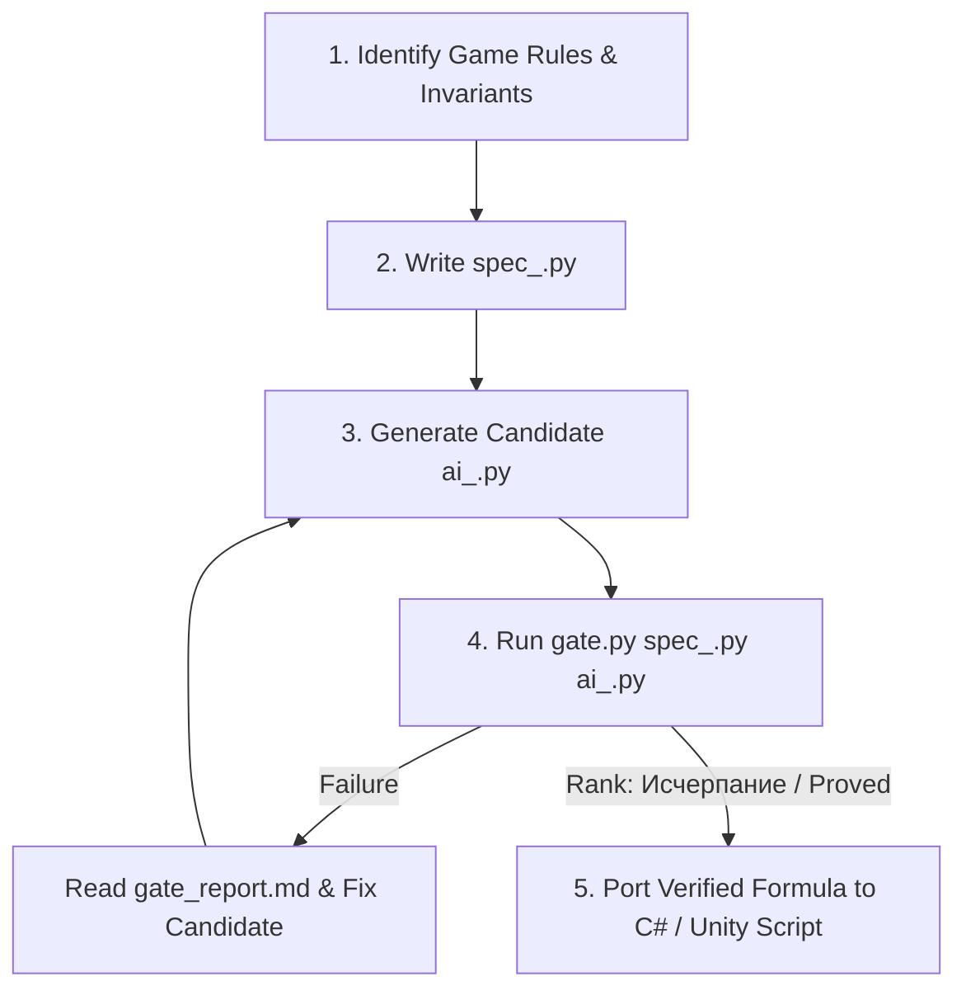

# Kern Gate — Automatic Verification of Critical Game Logic

Use this skill whenever a task requires writing or modifying **critical mathematical or algorithmic logic** (combat damage, armor mitigation, XP/leveling, economy, inventory stacking, drop rates) where edge-case bugs (negative values, overflow, division by zero, float rounding) could break game rules or corrupt game state.

> **DO NOT USE FOR:** UI elements, visual effects (VFX), audio clips, camera control, simple component getters/setters, or Unity `Transform` movements.

---

## 🎯 When to Trigger

Trigger `kern-gate` automatically when:
1. The user asks to write or modify a **formula, combat math, reward calculation, or game rule**.
2. The code contains **boundary risks** (e.g. Shield Gating, armor reduction, negative damage, floating-point precision issues).
3. The user explicitly requests verifying logic before placing it in Unity/C#.

---

## ⚙️ The Verification Workflow



### Path to Gate Executable
The gate system resides at: `C:\Users\mshat\Desktop\kern\gate.py`
Execution command: `python "C:\Users\mshat\Desktop\kern\gate.py" <spec_file> <candidate_file>`

---

## 📋 Step-by-Step Execution Guide

### Step 1: Create Specification File (`spec_<feature>.py`)
Create a Python specification file containing:
- `NAME`: Function name string.
- `DOC`: One-line description of the game mechanic.
- `REFERENCE`: The simplest, crystal-clear reference implementation.
- `EXAMPLES`: Explicit tuples of `((inputs...), expected_output)` representing the contract.
- `PROPERTIES`: Invariants that MUST always hold (e.g. `damage >= 0`, `Shield Gating` rules).
- `DOMAIN(rng)`: Random input generator for fuzzing against properties.
- `EXHAUSTIVE()`: Generator yielding all boundary combinations.

#### Example Template:
```python
# spec_combat_math.py
NAME = "calculate_mitigated_damage"
DOC = "Calculates damage after armor and shield gating"

def REFERENCE(damage, armor, shield):
    if damage <= 0: return (0.0, shield)
    raw = max(1.0, damage - armor)
    if shield > 0:
        return (0.0, max(0.0, shield - raw)) # Shield Gating
    return (raw, 0.0)

EXAMPLES = [
    ((1000.0, 10.0, 1.0), (0.0, 0.0)), # Shield gating test
    ((0.0, 10.0, 0.0), (0.0, 0.0)),    # Zero damage test
]

PROPERTIES = [
    ("hp damage >= 0", lambda a, r: r[0] >= 0.0),
    ("shield >= 0", lambda a, r: r[1] >= 0.0),
    ("shield gating holds", lambda a, r: r[0] == 0.0 if a[2] > 0 else True),
]

def DOMAIN(rng):
    return (rng.uniform(0, 500), rng.uniform(0, 50), rng.uniform(0, 100))

def EXHAUSTIVE():
    for d in [0.0, 50.0, 1000.0]:
        for a in [0.0, 20.0]:
            for s in [0.0, 1.0, 50.0]:
                yield (d, a, s)
```

---

### Step 2: Generate Candidate Implementation (`ai_<feature>.py`)
Write the candidate algorithm in a separate Python file:
```python
# ai_combat_math.py
def calculate_mitigated_damage(damage, armor, shield):
    if damage <= 0:
        return (0.0, shield)
    eff = max(1.0, damage - armor)
    if shield > 0:
        return (0.0, max(0.0, shield - eff))
    return (eff, 0.0)
```

---

### Step 3: Run the Gate
Execute:
`run_command(command="python C:\\Users\\mshat\\Desktop\\kern\\gate.py spec_<feature>.py ai_<feature>.py", cwd="C:\\Users\\mshat\\Desktop\\kern")`

---

### Step 4: Handle Failure vs Success

- **If Gate Fails (Rank < Исчерпание):**
  1. Inspect `gate_report.md` in the working directory.
  2. Extract the minimal counterexample (input, expected, got).
  3. Fix the candidate implementation `ai_<feature>.py`.
  4. Re-run `gate.py` until rank is `Исчерпание` or `Proved`.

- **If Gate Succeeds (Rank == Исчерпание / Proved):**
  1. The algorithm is mathematically and empirically verified.
  2. Port the clean, bug-free logic into the target C# Unity file (e.g. `PlayerStats.cs`, `Health.cs`).

---

## 💡 Best Practices for the Agent
1. **Never guess game rules:** Always ask or clarify intent if a rule like *Shield Gating* or *Max Cap* might be intentional.
2. **Keep specs simple:** 3-4 examples and 2 invariants are enough to catch 99% of AI edge-case bugs.
3. **Clean up temp files:** Keep `gate_registry.json` intact, but clean up temporary `spec_*.py` and `ai_*.py` when finished if needed.
